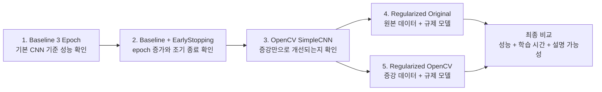
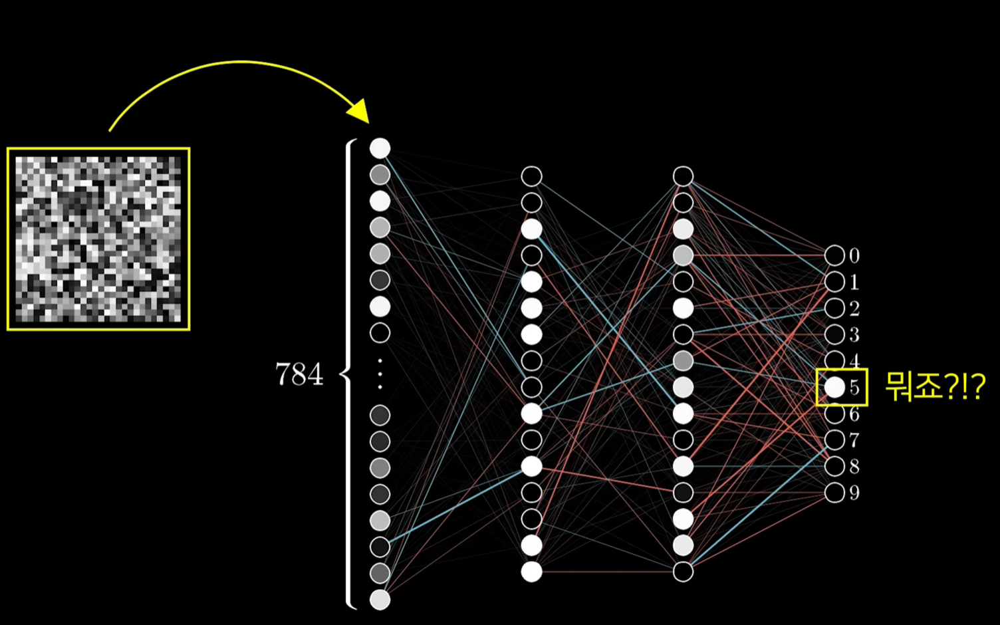

# Dog/Cat 이미지 분류 파이프라인 구축 및 분석 보고서

## 0. 문서 목적

이 문서는 Oxford-IIIT Pet Dataset(옥스퍼드 반려동물 데이터셋)을 사용해 강아지/고양이 이진 이미지 분류 파이프라인(pipeline, 처리 흐름)을 직접 구축한 과정과 결과를 정리한 보고서입니다.

이번 과제의 핵심은 최고 성능 모델을 만드는 것보다, 데이터 분리, PyTorch 학습 루프(training loop, 학습 반복 흐름), overfitting(과적합) 판단, precision(정밀도) / recall(재현율) 해석, 오분류 분석 과정을 본인 언어로 설명하는 것입니다.

## 0.1 주요 용어 정리

| 영어 용어 | 한국어 의미 | 쉬운 설명 |
|---|---|---|
| dataset | 데이터셋 | 학습과 평가에 사용하는 이미지와 라벨 묶음입니다. |
| label | 라벨 | 이미지의 정답입니다. 예: cat, dog |
| binary classification | 이진 분류 | 두 가지 class 중 하나를 고르는 분류입니다. |
| breed | 품종 | 고양이/강아지의 세부 종류입니다. |
| split | 데이터 분리 | 데이터를 train/validation/test로 나누는 과정입니다. |
| train | 학습 데이터 | 모델이 직접 공부하는 데이터입니다. |
| validation | 검증 데이터 | 학습 중 모델 상태를 확인하는 데이터입니다. |
| test | 테스트 데이터 | 최종 성능을 확인하는 데이터입니다. |
| stratified split | 층화 분리 | 특정 기준의 비율이 비슷하게 유지되도록 데이터를 나누는 방법입니다. |
| optimizer | 최적화 알고리즘 | 계산된 gradient를 이용해 가중치를 업데이트하는 방법입니다. |
| gradient | 기울기 | loss를 줄이기 위해 가중치를 어느 방향으로 바꿔야 하는지 나타내는 값입니다. |
| forward | 순전파 | 모델이 입력 이미지를 보고 예측값을 만드는 과정입니다. |
| loss | 손실 | 예측과 정답이 얼마나 다른지 나타내는 값입니다. |
| backward | 역전파 | loss를 기준으로 gradient를 계산하는 과정입니다. |
| epoch | 에포크 | 전체 train 데이터를 한 번 학습하는 단위입니다. |
| batch | 배치 | 이미지를 몇 장씩 묶어서 학습하는 단위입니다. |
| loss curve | 손실 곡선 | epoch마다 loss가 어떻게 변했는지 그린 그래프입니다. |
| overfitting | 과적합 | train 데이터는 잘 맞히지만 새로운 데이터에는 약해지는 현상입니다. |
| accuracy | 정확도 | 전체 중 몇 개를 맞혔는지 보는 지표입니다. |
| confusion matrix | 혼동 행렬 | 어떤 class를 어떤 class로 틀렸는지 보여주는 표입니다. |
| precision | 정밀도 | 모델이 특정 class라고 예측한 것 중 실제로 맞은 비율입니다. |
| recall | 재현율 | 실제 특정 class 중 모델이 찾아낸 비율입니다. |
| confidence | 확신도 | 모델이 자기 예측을 얼마나 확신하는지 나타내는 값입니다. |
| checkpoint | 체크포인트 | 학습 중 저장한 모델 파일입니다. |
| EarlyStopping | 조기 종료 | validation 성능이 더 좋아지지 않으면 학습을 멈추는 방법입니다. |
| BatchNorm | 배치 정규화 | 학습 중 feature 값의 분포를 안정화하는 방법입니다. |
| Dropout | 드롭아웃 | 일부 뉴런을 임시로 꺼서 과적합을 줄이는 방법입니다. |
| weight decay | 가중치 감쇠 | 가중치가 너무 커지지 않도록 억제하는 규제 방법입니다. |
| learning rate | 학습률 | 가중치를 한 번에 얼마나 크게 업데이트할지 정하는 값입니다. |
| scheduler | 스케줄러 | 학습 상황에 따라 learning rate를 조절하는 기능입니다. |
| augmentation | 데이터 증강 | 원본 이미지를 변형해 학습 데이터를 늘리는 방법입니다. |
| head ROI | 머리 관심 영역 | 동물의 얼굴/머리 위치 정보입니다. |
| segmentation | 영역 분할 | 이미지에서 동물과 배경을 나누는 정보입니다. |
| transfer learning | 전이학습 | 사전 학습 모델을 가져와 새 문제에 맞게 다시 학습하는 방법입니다. |
| pretrained model | 사전 학습 모델 | 큰 데이터셋으로 미리 학습된 모델입니다. |

## 1. 요구사항 대응표

| 요구사항 | 문서 위치 | 포함할 핵심 내용 |
|---|---|---|
| train(학습) / validation(검증) / test(테스트) 직접 구성 및 역할 설명 | 3장 | Oxford-IIIT Pet Dataset 선택 이유, 70/15/15 split(데이터 분리), 각 데이터셋 역할 |
| PyTorch 직접 학습 코드 작성 | 4장 | `optimizer.zero_grad -> forward -> loss -> backward -> step` 흐름 |
| train/val loss curve(손실 곡선)와 overfitting(과적합) 판단 | 7장 | baseline(기준 모델), OpenCV, regularized(규제 적용) 모델의 loss curve 비교 |
| accuracy(정확도), confusion matrix(혼동 행렬), precision(정밀도) / recall(재현율) 계산과 해석 | 8장 | test set(테스트셋) 기준 지표 비교와 상황별 중요 지표 정리 |
| 오분류 이미지 확인, 원인 규명, 방안 도출 | 9장, 10장 | confidence(확신도) 높은 오분류 확인, 실패 유형 분류, 개선 방향 |

## 2. 프로젝트 개요

### 2.1 과제 목적

- 강아지/고양이 이미지 분류 파이프라인을 직접 구축합니다.
- 면접 공통 질문인 데이터 분포, overfitting, precision/recall을 실습으로 검증합니다.
- 실무에서 중요한 실패 데이터 유형 분류와 패턴 도출 과정을 미니 버전으로 경험합니다.

### 2.2 사용 데이터셋

- 데이터셋(dataset): Oxford-IIIT Pet Dataset
- 구성: 37개 품종, 강아지/고양이 이미지
- 사용 방식: 품종 분류가 아니라 dog/cat binary classification(이진 분류)로 사용합니다.

### 2.3 Oxford-IIIT Pet Dataset을 선택한 이유

- Kaggle Cat and Dog 데이터셋은 train(학습) / test(테스트)가 이미 나누어져 있어 편리하지만, 이번 과제에서는 직접 train(학습) / validation(검증) / test(테스트)를 나누는 경험이 중요합니다.
- Oxford-IIIT Pet Dataset은 dog/cat 라벨뿐 아니라 품종 라벨도 가지고 있어, 나중에 품종 분류로 확장할 수 있습니다.
- breed(품종) 기준으로 데이터를 나누면 이진 분류를 하더라도 다양한 품종이 train(학습) / validation(검증) / test(테스트)에 고르게 들어가도록 설계할 수 있습니다.

## 3. 데이터 분리 전략

### 3.1 라벨 구성

이번 프로젝트에서는 `torchvision.datasets.OxfordIIITPet`에서 제공하는 binary label(이진 라벨) 정보를 사용했습니다.

정리할 내용:

- 이미지 경로
- dog/cat label(라벨)
- 품종 이름
- split(데이터 분리) 정보

### 3.2 train(학습) / validation(검증) / test(테스트) 비율

최종 실험에서는 `70 / 15 / 15` 비율을 사용했습니다.

| split(데이터 분리) | 역할 |
|---|---|
| train(학습) | 모델이 실제로 학습하는 데이터입니다. 가중치가 업데이트됩니다. |
| validation(검증) | 학습 중 모델 선택, overfitting(과적합) 판단, EarlyStopping(조기 종료)에 참고하는 데이터입니다. 가중치는 업데이트되지 않습니다. |
| test(테스트) | 최종 모델을 평가하기 위한 데이터입니다. 학습과 모델 선택에 사용하지 않습니다. |

이번 실험에서 최종 사용한 `split_70_15_15`의 dog/cat 분포는 다음과 같습니다.

| split 설정 | 데이터 역할 | label(라벨) | count(개수) |
|---|---|---|---:|
| split_70_15_15 | train | cat | 832 |
| split_70_15_15 | train | dog | 1,744 |
| split_70_15_15 | validation | cat | 178 |
| split_70_15_15 | validation | dog | 374 |
| split_70_15_15 | test | cat | 178 |
| split_70_15_15 | test | dog | 374 |

정리하면 train(학습)은 2,576장, validation(검증)은 552장, test(테스트)는 552장입니다. 전체적으로 dog 이미지가 cat 이미지보다 많기 때문에, accuracy(정확도)만 보면 dog를 잘 맞히는 모델이 좋아 보일 수 있습니다. 그래서 이후 평가에서는 confusion matrix(혼동 행렬), precision(정밀도), recall(재현율)을 함께 확인했습니다.

### 3.3 breed(품종) 기준 stratified split(층화 분리)을 사용한 이유

단순히 랜덤으로 나누면 특정 품종이 train(학습)에만 많이 들어가고 test(테스트)에는 적게 들어갈 수 있습니다.

이번 프로젝트는 dog/cat 이진 분류이지만, 품종별 특성이 dog/cat 판단에 영향을 줄 수 있으므로 breed(품종) 기준으로 고르게 나누는 것이 더 적절하다고 판단했습니다.

데이터 분리 결론:

> 이진 분류만 한다면 dog/cat 비율만 맞추면 된다고 생각할 수 있지만, 실제 이미지에서는 품종에 따라 생김새가 크게 다릅니다. 그래서 특정 품종이 한 split(데이터 분리)에 치우치지 않도록 breed(품종) 기준 stratified split(층화 분리)을 사용했습니다.

## 4. PyTorch 학습 파이프라인

### 4.1 직접 작성한 학습 루프

학습 흐름은 다음과 같습니다.

```python
optimizer.zero_grad()
outputs = model(images)
loss = criterion(outputs, labels)
loss.backward()
optimizer.step()
```

각 단계의 의미:

| 코드 | 의미 |
|---|---|
| `optimizer.zero_grad()` | 이전 batch(배치)에서 계산된 gradient(기울기)를 지웁니다. |
| `outputs = model(images)` | 모델이 이미지를 보고 예측합니다. forward(순전파) 단계입니다. |
| `loss = criterion(outputs, labels)` | 예측과 정답을 비교해 loss(손실)를 계산합니다. |
| `loss.backward()` | backward(역전파)를 통해 각 가중치가 얼마나 수정되어야 하는지 gradient(기울기)를 계산합니다. |
| `optimizer.step()` | 계산된 gradient(기울기)를 사용해 실제 가중치를 업데이트합니다. |

학습 루프 정리:

> 학습 코드는 zero_grad(기울기 초기화), forward(순전파), loss(손실), backward(역전파), step(가중치 업데이트) 흐름이 보이도록 직접 작성했습니다. 이 과정을 통해 모델이 예측하고, 정답과 비교해 오차를 계산하고, 오차를 줄이는 방향으로 가중치를 업데이트한다는 점을 확인했습니다.

## 5. 모델 실험 설계

이번 프로젝트에서는 한 번에 완성 모델을 만들기보다, 하나씩 개선하면서 비교했습니다.

실험 흐름은 다음과 같습니다. 실험 1, 2, 3은 순서대로 진행했고, 실험 4와 5는 규제 모델을 기준으로 원본 데이터와 OpenCV 증강 데이터를 비교하는 방식으로 진행했습니다.



텍스트로 정리하면 다음 흐름입니다.

```text
1. 기본 CNN 성능 확인
-> 2. EarlyStopping을 추가해 baseline 개선
-> 3. OpenCV 증강만으로 개선되는지 확인
-> 4. 원본 데이터 + 규제 모델
-> 5. OpenCV 증강 데이터 + 규제 모델

4번과 5번은 같은 규제 모델을 사용하되, 데이터 조건만 다르게 비교했습니다.
```

| 실험 | 데이터 | 모델/개선점 | 목적 |
|---|---|---|---|
| 실험 1 | 원본 train(학습) | Baseline(기준 모델) 3 Epoch(3회 학습 반복) SimpleCNN | 가장 기본적인 기준 성능 확인 |
| 실험 2 | 원본 train(학습) | Baseline + EarlyStopping(조기 종료) | epoch(학습 반복 횟수)를 늘렸을 때 개선되는지 확인 |
| 실험 3 | OpenCV 증강 train(학습) | SimpleCNN | augmentation(데이터 증강)만으로 개선되는지 확인 |
| 실험 4 | 원본 train(학습) | Regularized CNN(규제 적용 CNN) | regularization(규제)이 overfitting(과적합) 완화에 도움이 되는지 확인 |
| 실험 5 | OpenCV 증강 train(학습) | Regularized CNN(규제 적용 CNN) | 증강과 규제를 함께 적용했을 때 효과 확인 |

### 5.1 Baseline(기준 모델) SimpleCNN

처음에는 단순 CNN(합성곱 신경망)을 사용해 기준 모델을 만들었습니다.

주요 목적:

- PyTorch 학습 루프(training loop) 확인
- train(학습) / validation(검증) loss curve(손실 곡선) 확인
- overfitting(과적합)이 발생하는지 관찰

모델 설계 코드는 다음과 같습니다.

```python
class SimpleCNN(nn.Module):
    def __init__(self):
        super().__init__()

        self.features = nn.Sequential(
            nn.Conv2d(3, 16, kernel_size=3, padding=1),
            nn.ReLU(),
            nn.MaxPool2d(2),

            nn.Conv2d(16, 32, kernel_size=3, padding=1),
            nn.ReLU(),
            nn.MaxPool2d(2),

            nn.Conv2d(32, 64, kernel_size=3, padding=1),
            nn.ReLU(),
            nn.MaxPool2d(2),
        )

        self.classifier = nn.Sequential(
            nn.Flatten(),
            nn.Linear(64 * 16 * 16, 128),
            nn.ReLU(),
            nn.Linear(128, 2),
        )

    def forward(self, x):
        x = self.features(x)
        x = self.classifier(x)
        return x
```

레이어별 설계 이유:

| 구성 | 역할 | 넣은 이유 |
|---|---|---|
| `Conv2d(3, 16)` | RGB 이미지에서 작은 패턴을 찾습니다. | 입력 이미지가 RGB 3채널이므로 `in_channels=3`으로 시작했습니다. |
| `Conv2d(16, 32)`, `Conv2d(32, 64)` | 채널 수를 늘리며 더 다양한 특징을 찾습니다. | 처음에는 단순한 선/색/무늬를 보고, 뒤로 갈수록 귀, 눈, 얼굴 형태 같은 더 복잡한 특징을 보게 하려는 목적입니다. |
| `kernel_size=3` | 3x3 작은 창으로 주변 픽셀을 봅니다. | 이미지 CNN에서 자주 쓰는 기본 크기이고, 작은 패턴을 여러 층에서 조합하기 좋습니다. |
| `padding=1` | convolution 후 이미지 크기가 바로 줄어드는 것을 막습니다. | 특징을 뽑기 전에 가장자리 정보가 너무 빨리 사라지지 않게 하기 위해 사용했습니다. |
| `ReLU()` | 음수 값을 0으로 바꾸는 활성화 함수입니다. | 모델이 단순 직선 계산만 하지 않고 비선형 패턴을 학습할 수 있게 합니다. |
| `MaxPool2d(2)` | 이미지의 가로/세로 크기를 절반으로 줄입니다. | 중요한 특징은 남기고 계산량을 줄이며, 위치가 조금 달라도 비슷하게 인식하도록 도와줍니다. |
| `Flatten()` | 2차원 feature map(특징 지도)을 1줄 벡터로 펼칩니다. | 마지막 분류기인 Linear layer에 넣기 위한 형태로 바꿉니다. |
| `Linear(64 * 16 * 16, 128)` | 뽑힌 특징들을 조합합니다. | CNN이 찾은 여러 특징을 바탕으로 cat/dog 판단 근거를 만듭니다. |
| `Linear(128, 2)` | 최종 출력 2개를 만듭니다. | 이번 문제는 cat/dog 이진 분류이므로 출력 class를 2개로 설정했습니다. |

모델 설계 정리:

> Baseline 모델은 복잡한 모델보다 설명 가능한 SimpleCNN으로 시작했습니다. Conv2d로 이미지 특징을 뽑고, MaxPool2d로 크기를 줄이며, 마지막 Linear layer에서 cat/dog 두 클래스로 분류하도록 설계했습니다.

### 5.2 OpenCV 증강 실험

OpenCV로 train(학습) 이미지만 augmentation(데이터 증강)했습니다.

사용한 증강:

- 밝기 조정
- 대비 조정
- blur(흐림)
- 회전
- 좌우 반전

OpenCV 증강 실험에서는 모델 구조를 바꾸지 않고, train 데이터만 늘렸습니다. 이렇게 해야 성능 변화가 모델 구조 때문인지 데이터 증강 때문인지 더 깔끔하게 비교할 수 있습니다.

OpenCV 증강 후 train 데이터 수는 다음과 같습니다.

| dataset(데이터셋) | count(개수) | 설명 |
|---|---:|---|
| original train | 2,576 | 01 단계에서 만든 원본 train 이미지입니다. |
| augmented only | 12,880 | OpenCV로 새로 만든 증강 이미지만 센 개수입니다. |
| train used for 02-1 | 15,456 | 원본 train과 OpenCV 증강 이미지를 합쳐 실제 학습에 사용한 개수입니다. |

중요한 점은 validation(검증)과 test(테스트)는 증강하지 않았다는 것입니다. 모델은 늘어난 train 데이터로 학습하지만, 검증과 평가는 원본 이미지 기준으로 진행해야 실제 일반화 성능을 더 공정하게 확인할 수 있습니다.

핵심 코드는 다음과 같습니다.

```python
def brighten_image(image):
    return cv2.convertScaleAbs(image, alpha=1.0, beta=35)

def contrast_image(image):
    return cv2.convertScaleAbs(image, alpha=1.25, beta=0)

def blur_image(image):
    return cv2.GaussianBlur(image, (5, 5), 0)

def rotate_image(image):
    height, width = image.shape[:2]
    center = (width // 2, height // 2)
    rotation_matrix = cv2.getRotationMatrix2D(center, angle=8, scale=1.0)
    return cv2.warpAffine(image, rotation_matrix, (width, height), borderMode=cv2.BORDER_REFLECT_101)

def flip_image(image):
    return cv2.flip(image, 1)
```

증강별 의도:

| 증강 | 넣은 이유 |
|---|---|
| 밝기 조정 | 사진이 밝거나 어두운 상황에도 대응해보기 위해 사용했습니다. |
| 대비 조정 | 털 무늬나 얼굴 경계가 다르게 보이는 상황을 반영했습니다. |
| blur(흐림) | 초점이 조금 맞지 않은 사진 상황을 반영했습니다. |
| 회전 | 동물이 살짝 기울어진 사진에서도 특징을 찾도록 하기 위해 사용했습니다. |
| 좌우 반전 | 같은 동물이라도 방향이 바뀔 수 있으므로 사용했습니다. |

결과 해석:

> OpenCV 증강으로 train(학습) 데이터 수를 늘렸지만, 증강만으로는 overfitting(과적합)이 충분히 해결되지 않았습니다. 이는 비슷한 원본 이미지의 변형이 많아졌을 뿐, validation(검증) / test(테스트) 분포에 실제로 도움이 되는 다양성이 충분하지 않았을 가능성이 있습니다.

### 5.3 Regularized CNN(규제 적용 CNN)

overfitting(과적합)을 줄이기 위해 다음 방법을 추가했습니다.

- BatchNorm(배치 정규화): 학습 안정화
- Dropout(드롭아웃): 일부 뉴런을 임시로 꺼서 train(학습) 데이터 암기 완화
- weight decay(가중치 감쇠): 가중치가 너무 커지는 것 억제
- 낮춘 learning rate(학습률): 너무 빠른 과적합 완화
- LR Scheduler(학습률 조절기): validation loss(검증 손실)가 정체되면 learning rate 감소

규제 모델 코드는 다음과 같습니다.

```python
class RegularizedCNN(nn.Module):
    def __init__(self, dropout_p=0.5):
        super().__init__()

        self.features = nn.Sequential(
            nn.Conv2d(3, 16, kernel_size=3, padding=1),
            nn.BatchNorm2d(16),  # [규제] feature 분포를 안정화합니다.
            nn.ReLU(),
            nn.MaxPool2d(2),

            nn.Conv2d(16, 32, kernel_size=3, padding=1),
            nn.BatchNorm2d(32),  # [규제] 두 번째 convolution block도 안정화합니다.
            nn.ReLU(),
            nn.MaxPool2d(2),

            nn.Conv2d(32, 64, kernel_size=3, padding=1),
            nn.BatchNorm2d(64),  # [규제] 깊은 feature에서도 학습 흔들림을 줄입니다.
            nn.ReLU(),
            nn.MaxPool2d(2),
        )

        self.classifier = nn.Sequential(
            nn.Flatten(),
            nn.Dropout(p=dropout_p),  # [규제] 일부 뉴런을 꺼서 암기를 줄입니다.
            nn.Linear(64 * 16 * 16, 64),
            nn.ReLU(),
            nn.Dropout(p=dropout_p),  # [규제] classifier에서도 과적합을 줄입니다.
            nn.Linear(64, 2),
        )

    def forward(self, x):
        x = self.features(x)
        x = self.classifier(x)
        return x
```

학습 설정에서도 규제를 추가했습니다.

| 코드 | 강조 | 넣은 이유 |
|---|---|---|
| **`nn.BatchNorm2d(16)`** / **`nn.BatchNorm2d(32)`** / **`nn.BatchNorm2d(64)`** | **규제/안정화 코드** | 각 convolution layer 뒤의 feature 분포를 안정화해서 학습이 흔들리는 것을 줄입니다. |
| **`nn.Dropout(p=0.5)`** | **규제 코드** | 학습 중 일부 뉴런을 임시로 꺼서 train 데이터만 외우는 현상을 줄입니다. |
| **`nn.Linear(64 * 16 * 16, 64)`** | **모델 복잡도 감소** | baseline의 hidden size 128보다 작게 만들어 classifier가 과하게 외우는 힘을 줄였습니다. |
| **`weight_decay=1e-4`** | **규제 코드** | 가중치가 너무 커지는 것을 억제합니다. Keras의 L2 regularizer와 비슷한 역할로 이해할 수 있습니다. |
| **`lr=0.0005`** | **학습률 조정** | baseline보다 더 작은 learning rate로 너무 빠르게 train 데이터에 맞춰지는 것을 줄여봅니다. |
| **`ReduceLROnPlateau`** | **학습률 스케줄러** | validation loss가 정체되면 learning rate를 줄여 더 조심스럽게 학습하게 합니다. |

학습 설정 코드는 다음과 같습니다.

```python
optimizer = optim.Adam(
    model.parameters(),
    lr=0.0005,
    weight_decay=1e-4,
)

scheduler = optim.lr_scheduler.ReduceLROnPlateau(
    optimizer,
    mode="min",
    factor=0.5,
    patience=2,
)
```

규제 적용 이유:

> Baseline에서 train loss는 계속 낮아졌지만 validation loss가 안정적이지 않았습니다. 그래서 Regularized CNN에서는 BatchNorm으로 학습을 안정화하고, Dropout과 weight decay로 train 데이터 암기를 줄이며, learning rate와 scheduler로 학습 속도를 더 조심스럽게 조절했습니다.

### 5.4 실험별 결과 기록 공간

각 실험은 같은 형식으로 정리합니다.

- **실험 목적:** 왜 이 실험을 했는지 정리합니다.
- **주요 수치:** best validation loss, best validation accuracy, final accuracy, 학습 시간을 기록합니다.
- **loss curve:** train loss와 validation loss가 어떻게 변했는지 확인합니다.
- **해석:** overfitting(과적합), underfitting(과소적합), 개선 여부를 본인 언어로 정리합니다.

#### 5.4.1 실험 1: Baseline 3 Epoch

| 항목 | 값 |
|---|---:|
| best validation loss | 0.5486 |
| best validation accuracy | 0.7120 |
| final train loss | 0.5818 |
| final validation loss | 0.5486 |
| final train accuracy | 0.6925 |
| final validation accuracy | 0.7120 |
| 학습 시간 | 37.9초 |


해석 메모:

- 3 epoch만 학습했기 때문에 학습 시간이 가장 짧습니다.
- 하지만 validation accuracy(검증 정확도)가 낮아 최종 모델로 보기에는 부족합니다.
- 빠르지만 충분히 학습되지 않은 기준 모델로 사용했습니다.

실험 1 해석:

> Baseline 3 Epoch 모델은 가장 빠르게 학습되었지만 validation accuracy가 낮아 충분히 학습된 모델이라고 보기 어려웠습니다. 따라서 이후 실험에서 epoch를 늘리고 early stopping을 적용해 개선 가능성을 확인했습니다.

#### 5.4.2 실험 2: Baseline + EarlyStopping

| 항목 | 값 |
|---|---:|
| best validation loss | 0.5220 |
| best validation accuracy | 0.7536 |
| final train loss | 0.0504 |
| final validation loss | 1.1179 |
| final train accuracy | 0.9849 |
| final validation accuracy | 0.7627 |
| 학습 시간 | 133.6초 |


해석 메모:

- 3 epoch baseline보다 best validation loss와 accuracy가 개선되었습니다.
- 하지만 final train loss가 매우 낮고 final validation loss가 크게 올라 overfitting(과적합)이 강하게 나타났습니다.
- EarlyStopping(조기 종료)과 checkpoint(체크포인트)를 사용했기 때문에 마지막 epoch가 아니라 best epoch 모델을 저장할 수 있었습니다.

실험 2 해석:

> EarlyStopping을 적용하니 baseline보다 validation 성능은 개선되었지만, 학습이 진행될수록 train loss는 매우 낮아지고 validation loss는 올라가는 과적합 패턴이 확인되었습니다.

#### 5.4.3 실험 3: OpenCV SimpleCNN

| 항목 | 값 |
|---|---:|
| best validation loss | 0.5261 |
| best validation accuracy | 0.7645 |
| final train loss | 0.0156 |
| final validation loss | 2.1406 |
| final train accuracy | 0.9946 |
| final validation accuracy | 0.7536 |
| 학습 시간 | 468.3초 |


해석 메모:

- OpenCV augmentation(데이터 증강)으로 train 데이터 수를 늘렸지만 overfitting(과적합)이 해결되지 않았습니다.
- final train accuracy가 0.9946까지 올라간 반면 final validation loss는 크게 증가했습니다.
- 단순히 유사한 변형 이미지를 많이 만드는 것만으로는 일반화 성능이 충분히 좋아지지 않는다고 판단했습니다.

실험 3 해석:

> OpenCV 증강만 적용하면 데이터 수가 늘어나 성능이 좋아질 것이라고 예상했지만, 실제로는 train 데이터를 더 강하게 외우는 결과가 나타났습니다. 그래서 다음 실험에서는 데이터 증강보다 모델 쪽 규제를 추가했습니다.

#### 5.4.4 실험 4: Regularized Original

| 항목 | 값 |
|---|---:|
| best validation loss | 0.4877 |
| best validation accuracy | 0.7953 |
| final train loss | 0.3443 |
| final validation loss | 0.5058 |
| final train accuracy | 0.8424 |
| final validation accuracy | 0.7862 |
| 학습 시간 | 198.9초 |


해석 메모:

- baseline 계열보다 validation loss가 낮아졌고 validation accuracy도 좋아졌습니다.
- train과 validation 성능 차이가 baseline보다 안정적입니다.
- 학습 시간도 OpenCV 증강 모델보다 훨씬 짧아 성능과 효율의 균형이 좋습니다.

실험 4 해석:

> Regularized Original 모델은 BatchNorm, Dropout, weight decay, LR Scheduler를 추가해 과적합을 줄이려고 한 실험입니다. 결과적으로 validation loss와 accuracy가 baseline보다 개선되었고, 학습 시간도 과도하지 않아 최종 선택 후보로 판단했습니다.

#### 5.4.5 실험 5: Regularized OpenCV

| 항목 | 값 |
|---|---:|
| best validation loss | 0.4738 |
| best validation accuracy | 0.7862 |
| final train loss | 0.2440 |
| final validation loss | 0.5151 |
| final train accuracy | 0.8984 |
| final validation accuracy | 0.8043 |
| 학습 시간 | 913.6초 |


해석 메모:

- best validation loss는 가장 낮습니다.
- 하지만 best validation accuracy는 Regularized Original보다 높지 않고, 학습 시간이 크게 늘었습니다.
- Oxford-IIIT Pet Dataset은 비교적 좋은 조건의 이미지가 많아 OpenCV 증강 효과가 제한적이었을 가능성이 있습니다.

실험 5 해석:

> Regularized OpenCV 모델은 validation loss 기준으로는 가장 낮은 값을 보였지만, accuracy 차이가 크지 않았고 학습 시간이 크게 증가했습니다. 따라서 최종 모델은 성능과 효율의 균형을 고려해 Regularized Original로 선택했습니다.

## 6. 모델 비교와 최종 선택

### 6.1 전체 모델 비교 기준

모델 선택 시 하나의 숫자만 보지 않고 다음 기준을 함께 봤습니다.

- best validation loss(가장 낮은 검증 손실)
- best validation accuracy(가장 높은 검증 정확도)
- final validation accuracy(마지막 epoch의 검증 정확도)
- 학습 시간
- 모델 구조의 설명 가능성
- 데이터셋 특성

### 6.2 전체 실험 결과 비교표

| 모델 | best val loss | best val acc | final val acc | 학습 시간 | 해석 |
|---|---:|---:|---:|---:|---|
| Baseline 3 Epoch | 0.5486 | 0.7120 | 0.7120 | 37.9초 | 빠르지만 성능이 낮은 기준 모델 |
| Baseline EarlyStopping | 0.5220 | 0.7536 | 0.7627 | 133.6초 | baseline보다 개선되었지만 과적합 발생 |
| OpenCV SimpleCNN | 0.5261 | 0.7645 | 0.7536 | 468.3초 | 증강만으로는 과적합 해결 부족 |
| Regularized Original | 0.4877 | 0.7953 | 0.7862 | 198.9초 | 성능과 효율의 균형이 가장 좋음 |
| Regularized OpenCV | 0.4738 | 0.7862 | 0.8043 | 913.6초 | loss는 가장 낮지만 학습 시간이 큼 |

### 6.3 전체 비교 그래프

아래 그래프는 03 분석 노트북에서 생성한 전체 모델 비교 그래프입니다.


그래프 해석:

- best validation loss(가장 낮은 검증 손실)는 Regularized OpenCV가 가장 낮습니다.
- best validation accuracy(가장 높은 검증 정확도)는 Regularized Original이 가장 높습니다.
- 학습 시간은 Regularized OpenCV가 가장 길고, Regularized Original은 성능 대비 효율이 좋습니다.

전체 비교 결론:

> 전체 모델을 비교했을 때 Regularized OpenCV는 validation loss가 가장 낮았지만, 학습 시간이 크게 증가했습니다. 반면 Regularized Original은 validation accuracy가 가장 높고 학습 시간도 상대적으로 짧았습니다. 따라서 단순히 loss 하나만 보지 않고 성능과 효율을 함께 고려해 Regularized Original을 최종 모델로 선택했습니다.

### 6.4 최종 선택 모델

최종 선택 후보는 `Regularized Original`(원본 데이터 + 규제 모델) 모델입니다.

선택 이유:

- baseline(기준 모델)보다 validation loss(검증 손실)와 accuracy(정확도)가 개선되었습니다.
- OpenCV 증강 모델보다 학습 시간이 훨씬 짧습니다.
- OpenCV 증강 모델은 best validation loss(가장 낮은 검증 손실)가 조금 더 낮았지만 accuracy(정확도) 차이가 크지 않았고, 학습 시간이 크게 늘었습니다.
- Oxford-IIIT Pet Dataset은 비교적 좋은 조건에서 촬영된 이미지가 많아, 조명 변화나 blur 중심의 증강 효과가 제한적이었을 수 있습니다.

최종 선택 근거:

> OpenCV 증강 모델의 best validation loss(가장 낮은 검증 손실)가 조금 더 낮았지만, accuracy(정확도) 차이는 크지 않았고 학습 시간은 훨씬 길었습니다. 따라서 성능과 효율의 균형을 고려해 Regularized Original(원본 데이터 + 규제 모델)을 최종 선택 후보로 정했습니다.

## 7. Loss Curve(손실 곡선)와 Overfitting(과적합) 판단

### 7.1 train loss(학습 손실)와 validation loss(검증 손실)의 의미

- train loss(학습 손실): 모델이 학습한 데이터에서의 오차입니다.
- validation loss(검증 손실): 학습에 직접 사용하지 않은 데이터에서의 오차입니다.

### 7.2 overfitting(과적합) 판단 기준

overfitting(과적합)은 train loss(학습 손실)는 계속 낮아지지만 validation loss(검증 손실)가 다시 올라가는 패턴으로 판단했습니다.

해석:

> train(학습) 데이터에는 점점 잘 맞지만, 새로운 데이터인 validation(검증) 데이터에는 오히려 약해졌다는 의미입니다. 이는 모델이 일반적인 dog/cat 특징을 배운 것이 아니라 train 데이터의 특정 패턴까지 외우기 시작했을 가능성을 보여줍니다.

### 7.3 실험별 관찰

- Baseline(기준 모델): train loss(학습 손실)는 낮아졌지만 validation loss(검증 손실)가 올라가 overfitting(과적합) 신호가 나타났습니다.
- OpenCV-only(OpenCV 증강만 적용): 데이터 수는 늘었지만 overfitting(과적합)이 충분히 해결되지 않았습니다.
- Regularized CNN(규제 적용 CNN): validation loss(검증 손실)가 더 안정적으로 낮아져 overfitting(과적합) 완화 효과가 있었습니다.

## 8. 최종 평가 지표 분석

### 8.1 accuracy(정확도)

전체 test(테스트) 이미지 중 모델이 맞힌 비율입니다.

03 평가 노트북에서 test set(테스트셋)으로 계산한 accuracy(정확도)는 다음과 같습니다.

| 모델 | 맞힌 개수 / 전체 개수 | accuracy(정확도) | 해석 |
|---|---:|---:|---|
| Regularized Original | 425 / 552 | 0.7699 | 최종 선택 후보입니다. 성능과 학습 시간의 균형이 좋았습니다. |
| Regularized OpenCV | 431 / 552 | 0.7808 | test accuracy는 조금 더 높았지만, 학습 시간이 훨씬 길었습니다. |

test set(테스트셋)만 보면 Regularized OpenCV가 약 1.1%p 정도 높았습니다. 하지만 최종 선택은 test accuracy 하나만 보고 결정하지 않고, validation loss(검증 손실), validation accuracy(검증 정확도), 학습 시간, 실험 목적을 함께 보고 판단했습니다.

장점:

- 직관적입니다.
- 데이터가 균형적일 때 기본 비교 지표로 좋습니다.

한계:

- 어떤 class에서 틀렸는지 알기 어렵습니다.

### 8.2 confusion matrix(혼동 행렬)

모델이 어떤 방향으로 틀렸는지 보여줍니다.

예를 들어:

- 실제 cat을 dog로 예측한 경우
- 실제 dog를 cat으로 예측한 경우

실험에서 비교한 두 규제 모델의 test set(테스트셋) confusion matrix(혼동 행렬)는 다음과 같습니다.


| 모델 | 실제 cat -> 예측 cat | 실제 cat -> 예측 dog | 실제 dog -> 예측 cat | 실제 dog -> 예측 dog | 해석 |
|---|---:|---:|---:|---:|---|
| Regularized Original | 102 | 76 | 51 | 323 | dog는 비교적 잘 찾지만, cat을 dog로 착각하는 경우가 많았습니다. |
| Regularized OpenCV | 142 | 36 | 85 | 289 | cat 오분류는 줄었지만, dog를 cat으로 착각하는 경우가 늘었습니다. |

recall(재현율) 관점에서 보면 차이가 더 잘 보입니다.

```text
Regularized Original cat recall = 102 / (102 + 76) = 0.573
Regularized Original dog recall = 323 / (323 + 51) = 0.864

Regularized OpenCV cat recall = 142 / (142 + 36) = 0.798
Regularized OpenCV dog recall = 289 / (289 + 85) = 0.773
```

즉, Regularized Original은 dog를 잘 찾는 쪽으로 치우쳐 있고, Regularized OpenCV는 cat을 더 잘 찾도록 바뀌었지만 dog 쪽 오분류가 늘었습니다. 이 그래프를 통해 accuracy(정확도) 하나만 보는 것보다, 어떤 class(분류 클래스)에서 어떤 방향으로 틀렸는지 보는 것이 중요하다고 판단했습니다.

### 8.3 precision(정밀도)

모델이 특정 class(분류 클래스)라고 예측한 것 중 실제로 맞은 비율입니다.

예시:

```text
cat precision(고양이 정밀도) = 맞게 cat이라고 예측한 수 / cat이라고 예측한 전체 수
```

test set(테스트셋) 기준 precision(정밀도)은 다음과 같습니다.

| 모델 | macro precision(평균 정밀도) | cat precision | dog precision | 해석 |
|---|---:|---:|---:|---|
| Regularized Original | 0.7381 | 0.6667 | 0.8095 | dog라고 예측한 결과는 비교적 믿을 만하지만, cat 예측은 상대적으로 약했습니다. |
| Regularized OpenCV | 0.7574 | 0.6256 | 0.8892 | dog precision이 높아서 dog라고 예측했을 때 실제 dog일 가능성이 높았습니다. |

계산식으로 보면 다음과 같습니다.

```text
Regularized Original cat precision = 102 / (102 + 51) = 0.667
Regularized Original dog precision = 323 / (323 + 76) = 0.810

Regularized OpenCV cat precision = 142 / (142 + 85) = 0.626
Regularized OpenCV dog precision = 289 / (289 + 36) = 0.889
```

precision(정밀도)이 중요한 상황:

- 모델이 예측한 결과를 얼마나 믿을 수 있는지가 중요할 때
- 잘못된 자동 태그를 줄이고 싶을 때

### 8.4 recall(재현율)

실제 특정 class(분류 클래스) 중 모델이 찾아낸 비율입니다.

예시:

```text
cat recall(고양이 재현율) = 맞게 cat이라고 예측한 수 / 실제 cat 전체 수
```

test set(테스트셋) 기준 recall(재현율)은 다음과 같습니다.

| 모델 | macro recall(평균 재현율) | cat recall | dog recall | 해석 |
|---|---:|---:|---:|---|
| Regularized Original | 0.7183 | 0.5730 | 0.8636 | 실제 dog는 잘 찾지만, 실제 cat을 놓치는 경우가 많았습니다. |
| Regularized OpenCV | 0.7852 | 0.7978 | 0.7727 | cat recall은 크게 좋아졌지만 dog recall은 낮아졌습니다. |

recall(재현율)이 중요한 상황:

- 특정 class를 놓치지 않는 것이 중요할 때
- 실제 dog 이미지를 최대한 빠짐없이 찾아야 할 때

### 8.5 macro average(단순 평균)

cat과 dog를 같은 비중으로 보고 평균낸 값입니다.

test set(테스트셋) 기준 macro average(단순 평균)는 다음과 같습니다.

| 모델 | macro precision | macro recall | macro f1-score | 해석 |
|---|---:|---:|---:|---|
| Regularized Original | 0.7381 | 0.7183 | 0.7260 | dog 성능은 좋지만 cat 성능이 낮아 평균 점수가 내려갔습니다. |
| Regularized OpenCV | 0.7574 | 0.7852 | 0.7641 | test 기준으로는 두 class를 더 균형 있게 맞힌 편입니다. |

f1-score(F1 점수)는 precision(정밀도)과 recall(재현율)을 함께 보는 지표입니다. 이번 test 결과에서는 Regularized OpenCV가 accuracy와 macro f1-score 모두 조금 더 높았습니다. 다만 OpenCV 모델은 학습 시간이 약 913.6초로 Regularized Original의 약 198.9초보다 훨씬 길었기 때문에, 최종 선택에서는 성능과 효율을 함께 고려했습니다.

평가지표 해석:

> accuracy(정확도)는 전체 정답률을 보여주지만, 어떤 class(분류 클래스)에서 어떤 방향으로 틀렸는지는 알 수 없습니다. test set 기준으로 Regularized OpenCV의 accuracy가 0.7808로 Regularized Original의 0.7699보다 조금 높았습니다. 하지만 confusion matrix(혼동 행렬)를 보니 Original은 cat을 dog로 틀리는 경향이 강했고, OpenCV는 dog를 cat으로 틀리는 경향이 강했습니다. 그래서 accuracy 하나만 보지 않고 precision(정밀도), recall(재현율), 학습 시간까지 함께 비교했습니다.

## 9. 오분류 이미지 분석

### 9.1 분석 방법

1. test set(테스트셋)에서 예측을 수행했습니다.
2. 실제 라벨과 예측 라벨이 다른 이미지를 추출했습니다.
3. confidence(확신도)가 높은 오분류부터 확인했습니다.
4. 이미지, 실제 라벨, 예측 라벨, confidence(확신도), breed(품종)를 함께 확인했습니다.
5. 반복되는 실패 유형을 분류했습니다.

### 9.2 confidence(확신도)를 함께 본 이유

confidence(확신도)는 모델이 자기 예측을 얼마나 확신했는지를 의미합니다.

- confidence(확신도)가 낮은 오분류: 모델도 애매하게 헷갈린 경우
- confidence(확신도)가 높은 오분류: 모델이 잘못된 특징을 강하게 믿은 경우

### 9.3 실제 오분류 표 해석

03 분석 노트북과 03-1 오분류 viewer 노트북을 이용해 오분류 결과를 확인했습니다.

최종 선택 후보인 `Regularized Original` 모델의 오분류 방향은 다음과 같습니다.

| 실제 라벨 | 예측 라벨 | 오분류 개수 | 해석 |
|---|---|---:|---|
| cat | dog | 76 | 실제 고양이를 강아지로 예측한 경우가 더 많았습니다. |
| dog | cat | 51 | 실제 강아지를 고양이로 예측한 경우도 있었지만 cat -> dog보다 적었습니다. |

즉, 최종 선택 후보 모델은 test set(테스트셋)에서 **고양이를 강아지로 잘못 예측하는 방향이 더 많았습니다.**

confidence(확신도)가 높은 오분류를 내림차순으로 확인했을 때, 상위 오분류는 대부분 `cat -> dog` 방향이었습니다.

| 순위 | 실제 라벨 | 예측 라벨 | confidence | 품종 |
|---:|---|---|---:|---|
| 1 | cat | dog | 0.9819 | British Shorthair |
| 2 | cat | dog | 0.9681 | Egyptian Mau |
| 3 | cat | dog | 0.9233 | Bengal |
| 4 | cat | dog | 0.9193 | Siamese |
| 5 | cat | dog | 0.9190 | Sphynx |
| 6 | cat | dog | 0.9136 | Birman |
| 7 | cat | dog | 0.9131 | Sphynx |
| 8 | cat | dog | 0.9022 | Bombay |
| 9 | cat | dog | 0.8818 | Birman |
| 10 | cat | dog | 0.8537 | Persian |

이 결과에서 중요하게 본 점은 단순히 틀린 것이 아니라, **모델이 높은 확신으로 고양이를 강아지라고 판단한 사례가 있었다는 점**입니다.

상위 confidence(확신도) 오분류 이미지는 03-1 노트북에서 직접 열어보고 확인했습니다.

아래 이미지는 `Regularized Original` 모델의 오분류 이미지를 confidence(확신도)가 높은 순서로 모아 본 것입니다. 03-1 노트북의 Step 4를 실행하면 `outputs/figures/regularized_original_misclassified_grid.png`로 저장됩니다.


| 순위 | 품종 | 오분류 방향 | confidence |
|---:|---|---|---:|
| 1 | British Shorthair | cat -> dog | 0.9819 |
| 2 | Egyptian Mau | cat -> dog | 0.9681 |
| 3 | Bengal | cat -> dog | 0.9233 |
| 4 | Siamese | cat -> dog | 0.9193 |
| 5 | Sphynx | cat -> dog | 0.9190 |

confidence(확신도)가 높은데 틀린 이미지는 모델이 잘못된 특징을 강하게 믿은 사례이므로, 발표에서는 "모델이 어떤 이미지를 어려워하는지 직접 확인했다"는 근거로 사용합니다.

확인한 오분류 사례는 다음과 같이 정리했습니다.

| 이미지 | 오분류 정보 | 관찰 내용 | 원인 가설 |
|---|---|---|---|
|  | 실제: cat<br>예측: dog<br>confidence: 0.9819<br>품종: British Shorthair | 얼굴은 비교적 보였지만, 얼굴 이외의 몸통 부분이 blur(흐림) 처리된 것처럼 보였습니다. | 몸통의 형태나 전체 실루엣 특징을 확인하기 어려워 모델이 cat의 전체적인 특징을 충분히 보지 못하고 dog로 강하게 예측했을 가능성이 있습니다. |
|  | 실제: cat<br>예측: dog<br>confidence: 0.9193<br>품종: Siamese | 눈 색상이 빛 반사 때문에 붉게 보이고, 몸을 움츠린 자세라 머리 부분을 제외하면 cat/dog 구분 특징이 약해 보였습니다. | 눈 주변 특징이 빛 반사로 왜곡되고, 몸통 실루엣이 둥글게 뭉쳐 보여 모델이 고양이의 세부 특징보다 애매한 전체 형태를 보고 dog로 예측했을 가능성이 있습니다. |
| <br><br> | 실제: cat<br>예측: dog<br>confidence: 0.9190 / 0.9131 / 0.8420<br>품종: Sphynx | 상위 오분류에 Sphynx가 여러 번 포함되었습니다. 사진 자체에 큰 이상이 있다기보다, Sphynx는 털이 거의 없고 피부색과 체형이 일반적인 고양이 이미지와 다르게 보였습니다. | 모델이 일반적인 털이 있는 고양이 특징에 더 익숙해져 있어서 Sphynx의 품종 특성을 cat 특징으로 충분히 학습하지 못했을 가능성이 있습니다. Sphynx처럼 오분류가 반복되는 품종은 OpenCV augmentation(데이터 증강)을 품종 중심으로 보강하면 개선될 수 있다고 판단했습니다. |
| <br><br> | 실제/예측: dog -> cat, dog -> cat, cat -> dog<br>confidence: 0.7347 / 0.7086 / 0.6817<br>품종: Chihuahua / Newfoundland / Bengal | 흑백 이미지, 낮은 해상도, 과한 빛이나 노이즈가 있는 이미지처럼 입력 품질이 낮은 사례였습니다. 동물의 털, 눈, 얼굴 윤곽, 몸통 실루엣 같은 핵심 특징이 선명하게 보이지 않았습니다. | 이런 이미지는 모델이 동물의 실제 특징보다 노이즈, 밝기, 흐림 같은 품질 문제를 잘못된 근거로 사용할 가능성이 있습니다. 학습 데이터에 너무 많이 포함되면 일반적인 특징 학습을 방해할 수 있으므로, 데이터 품질 기준을 두고 제외하거나 별도 low-quality 그룹으로 관리하는 것이 좋다고 판단했습니다. |
|  | 실제: dog<br>예측: cat<br>confidence: 0.6499<br>품종: Japanese Chin | 강아지 미용 스타일 때문에 일반적으로 떠올리는 강아지 품종의 모습과 다르게 보였습니다. 털이 정리된 형태와 얼굴 주변의 긴 털이 cat처럼 보일 수 있다고 판단했습니다. | 모델이 품종 자체보다 겉으로 보이는 털 모양, 얼굴 주변 실루엣, 미용 스타일을 강하게 참고했을 가능성이 있습니다. 같은 품종이라도 미용 상태에 따라 모습이 크게 달라지므로, 다양한 미용 스타일의 강아지 데이터를 더 포함하면 개선될 수 있습니다. |
| <br> | 실제: dog<br>예측: cat<br>confidence: 0.7477 / 0.6719<br>품종: Pug | 같은 Pug 품종이지만 두 이미지 모두 빨간색 배경 비중이 크게 보였습니다. 또한 한 이미지는 몸집이 더 크고 앉은 자세이며, 다른 이미지는 비교적 날씬하고 누운 자세라 같은 품종 안에서도 체형과 자세 차이가 크게 나타났습니다. | 모델이 Pug의 얼굴 특징뿐 아니라 배경 색상, 자세, 몸무게/체형 차이를 함께 참고했을 가능성이 있습니다. 같은 품종 안에서도 다양한 체형과 자세, 배경 조건을 포함해 학습하거나 segmentation(영역 분할), crop(자르기)으로 배경 영향을 줄이면 개선될 수 있다고 판단했습니다. |

품종별로 오분류가 많이 나온 상위 품종은 다음과 같습니다.

| 품종 | 오분류 개수 |
|---|---:|
| British Shorthair | 9 |
| Sphynx | 8 |
| Egyptian Mau | 7 |
| Bombay | 7 |
| Russian Blue | 7 |
| Bengal | 7 |
| Birman | 7 |
| Chihuahua | 6 |
| Scottish Terrier | 6 |
| Persian | 6 |

CSV 기준으로 보면 고양이 품종이 상위에 많이 포함되어 있습니다. 따라서 이 모델은 특정 고양이 품종에서 cat 특징을 충분히 잡지 못하고 dog로 판단한 경우가 있었다고 해석했습니다.

03-1 노트북에서는 위 이미지들을 confidence 높은 순서로 직접 확인했습니다. 확인할 때는 다음 특징을 중심으로 보았습니다.

- 얼굴이 정면으로 잘 보이는지
- 귀, 눈, 코 같은 cat/dog 구분 특징이 충분히 보이는지
- 동물이 작게 찍혔거나 일부만 보이는지
- 배경이 복잡해서 모델이 배경을 참고했을 가능성이 있는지
- 품종 자체가 일반적인 cat/dog 이미지와 다르게 보이는지

비교 후보인 `Regularized OpenCV` 모델은 오분류 방향이 다르게 나타났습니다.

| 모델 | cat -> dog | dog -> cat | 해석 |
|---|---:|---:|---|
| Regularized Original | 76 | 51 | 고양이를 강아지로 착각한 경우가 더 많았습니다. |
| Regularized OpenCV | 36 | 85 | OpenCV 증강 후에는 강아지를 고양이로 착각한 경우가 더 많았습니다. |

이 차이는 OpenCV augmentation(데이터 증강)이 단순히 성능만 바꾼 것이 아니라, 모델이 헷갈리는 방향도 바꿀 수 있음을 보여줍니다.

Regularized OpenCV 모델의 confidence(확신도) 상위 오분류도 확인했습니다.

| 순위 | 실제 라벨 | 예측 라벨 | confidence | 품종 |
|---:|---|---|---:|---|
| 1 | cat | dog | 0.9999 | Birman |
| 2 | cat | dog | 0.9991 | British Shorthair |
| 3 | cat | dog | 0.9958 | Bombay |
| 4 | cat | dog | 0.9944 | Bengal |
| 5 | cat | dog | 0.9840 | Egyptian Mau |
| 6 | cat | dog | 0.9502 | Russian Blue |
| 7 | cat | dog | 0.9501 | Bengal |
| 8 | cat | dog | 0.9465 | Ragdoll |
| 9 | cat | dog | 0.9076 | Russian Blue |
| 10 | cat | dog | 0.9014 | Siamese |

흥미로운 점은 전체 오분류 개수로는 Regularized OpenCV가 `dog -> cat`을 더 많이 틀렸지만, confidence(확신도)가 가장 높은 오분류 상위 10개는 모두 `cat -> dog`였다는 점입니다. 즉, 전체 실패 방향과 "모델이 매우 자신 있게 틀린 사례"는 다를 수 있습니다. 그래서 오분류 분석에서는 개수만 보지 않고 confidence 순서로도 확인했습니다.

오분류 방향 해석:

> 오분류 이미지를 confidence가 높은 순서로 확인했습니다. 최종 선택 후보인 Regularized Original 모델에서는 실제 cat을 dog로 예측한 경우가 76건으로, dog를 cat으로 예측한 51건보다 많았습니다. 특히 confidence 상위 오분류는 모두 cat -> dog 방향이었고, British Shorthair, Sphynx, Egyptian Mau, Bengal 같은 고양이 품종이 포함되어 있었습니다. 비교 모델인 Regularized OpenCV는 전체 오분류에서는 dog -> cat이 더 많았지만, confidence 상위 오분류는 cat -> dog가 많았습니다. 이를 통해 오분류 분석에서는 전체 개수와 높은 확신도의 실패 사례를 함께 봐야 한다고 판단했습니다.

### 9.4 주요 오분류 원인 후보

| 원인 유형 | 설명 | 개선 방향 |
|---|---|---|
| 얼굴 일부만 보임 | 눈, 귀, 코 등 핵심 특징이 부족함 | head ROI(머리 관심 영역) 활용, 더 큰 입력 이미지 |
| 배경이 복잡함 | 모델이 배경을 잘못된 근거로 사용할 수 있음 | segmentation(영역 분할) 활용 |
| 배경 색상/체형 차이 | 같은 품종이라도 배경 색 비중, 체형, 자세가 크게 다르면 모델이 다른 class(클래스)처럼 볼 수 있음 | 배경 색상 다양화, 같은 품종의 다양한 체형/자세 데이터 추가, segmentation(영역 분할) 또는 crop(자르기) |
| 잘못된 단서 학습 | 모델이 cat/dog의 본질적인 형태보다 배경, 색감, 노이즈, 특정 자세 같은 우연한 특징을 근거로 삼을 수 있음 | 오분류 이미지 확인, 원인 유형별 데이터 보강, ROI(관심 영역) 또는 segmentation(영역 분할) 활용 |
| 품종 특성이 애매함 | Sphynx처럼 일반적인 고양이 이미지와 다르게 보이는 품종에서 반복 오분류가 발생할 수 있음 | 품종별 오분류 분석, 해당 품종 중심 데이터 증강 |
| 미용 스타일 차이 | 강아지 미용 상태에 따라 일반적으로 떠올리는 품종 모습과 달라질 수 있음 | 같은 품종의 다양한 미용 스타일 데이터 추가 |
| 어둡거나 흐림 | 얼굴 이외의 몸통이나 전체 실루엣 특징이 잘 보이지 않을 수 있음 | 실패 유형에 맞춘 밝기/blur(흐림) 증강 |
| 이미지 품질이 낮음 | 흑백, 낮은 해상도, 과한 빛, 노이즈 때문에 핵심 특징이 왜곡될 수 있음 | 학습 데이터 품질 기준 설정, 제외 여부 검토, low-quality 그룹 별도 분석 |
| 동물이 작게 찍힘 | 객체 특징보다 배경 비중이 큼 | crop(자르기), ROI(관심 영역), segmentation(영역 분할) |

오분류 원인 정리:

> 오분류 이미지를 직접 확인한 결과, 모델이 무작위로 틀린 것이 아니라 얼굴 일부만 보이는 경우, 배경이 복잡한 경우, 품종 특성이 애매한 경우처럼 반복되는 실패 유형이 있었습니다. 이 과정을 통해 단순 점수 개선보다 실패 유형을 분류하고 개선 방향을 찾는 것이 실무적으로 중요하다고 느꼈습니다.

### 9.5 오분류 해석 관점: 모델은 의미보다 패턴을 볼 수 있음

손글씨 숫자 분류 CNN 예시를 보면, 사람이 보기에는 이상한 noise(노이즈)가 낀 이미지인데도 모델이 높은 confidence(확신도)로 특정 숫자, 예를 들어 `5`라고 예측하는 경우가 있습니다. 이 예시는 모델이 숫자의 의미를 사람처럼 이해했다기보다, 학습 데이터 안에서 `5`와 관련 있다고 배운 픽셀 패턴을 보고 분류했을 가능성을 보여줍니다.



이번 dog/cat 분류에서도 비슷한 관점으로 오분류를 해석했습니다. 모델은 이미지를 보고 "고양이는 이렇게 생겼다", "강아지는 이렇게 생겼다"를 사람처럼 이해하는 것이 아니라, 제한된 train dataset(학습 데이터셋) 안에서 loss(손실)를 줄이는 데 도움이 된 시각적 패턴을 학습합니다. 그래서 실제로 cat과 dog이 매우 비슷하게 보여서 틀린 경우도 있지만, 반대로 사람이 보기에는 명확한 이미지인데도 배경 색상, 빛 반사, blur(흐림), 특정 품종의 특이한 체형, 미용 스타일 같은 이상한 단서를 보고 틀린 경우도 있었습니다.

따라서 오분류 원인을 단순히 "모델이 고양이와 강아지를 헷갈렸다"로만 정리하지 않고, 모델이 어떤 잘못된 단서를 보고 판단했는지까지 확인하는 것이 중요하다고 판단했습니다. 이 관점은 향후 실무에서 failure data(실패 데이터)를 유형별로 분류하고, 어떤 데이터나 전처리를 보강해야 하는지 찾는 과정과 연결됩니다.

오분류 해석 결론:

> 손글씨 숫자 분류 CNN에서 노이즈 이미지를 보고도 높은 확신도로 특정 숫자라고 예측하는 예시처럼, CNN은 사람이 보는 의미를 그대로 이해하는 것이 아니라 학습 데이터 안에서 분류에 도움이 된 패턴을 사용합니다. 이번 dog/cat 모델도 마찬가지로, 진짜로 cat과 dog이 비슷해서 틀린 경우도 있었지만 배경, 색감, 빛 반사, blur, 품종별 특이한 체형 같은 이상한 단서를 보고 틀린 경우도 있었습니다. 그래서 오분류 분석은 모델이 무엇을 잘못된 근거로 사용했는지 찾는 과정이라고 정리했습니다.

## 10. 향후 개선 방향

### 10.1 head ROI(머리 관심 영역) 활용

Oxford-IIIT Pet Dataset에는 동물의 머리 위치 정보가 포함되어 있습니다.

dog/cat 구분에는 얼굴, 귀, 눈, 코 주변 특징이 중요하므로, head ROI(머리 관심 영역)를 활용하면 모델이 더 중요한 영역을 볼 수 있습니다.

### 10.2 segmentation(영역 분할) 활용

배경이 복잡한 이미지에서 모델이 배경을 잘못된 근거로 사용할 수 있습니다.

segmentation annotation(영역 분할 주석 정보)을 활용하면 동물 영역에 더 집중하도록 만들 수 있습니다.

### 10.3 실패 유형에 맞춘 데이터 증강

OpenCV augmentation(데이터 증강)을 무작정 많이 적용하는 것보다, 오분류 원인에 맞춰 증강하는 것이 더 적절합니다.

예시:

- 어두운 사진에서 많이 틀리면 밝기/대비 증강
- 흐린 사진에서 많이 틀리면 blur(흐림) 대응
- 위치 변화에서 많이 틀리면 crop(자르기) / rotate(회전) 조정

이번 실험 결과를 보면 `Regularized Original` 모델은 실제 cat을 dog로 예측하는 경우가 많았습니다. 반면 `Regularized OpenCV` 모델은 cat recall(고양이 재현율)이 0.5730에서 0.7978로 좋아졌습니다.

이 결과를 바탕으로 다음 추가 실험을 생각했습니다.

| 추가 실험 아이디어 | 이유 | 확인할 지표 |
|---|---|---|
| cat 이미지 중심 OpenCV 증강 | Original 모델이 cat을 dog로 착각하는 경우가 많았기 때문에 cat 특징을 더 다양하게 보여줍니다. | cat recall, cat -> dog 오분류 개수 |
| cat은 더 많이, dog는 적게 증강 | 전체 증강을 똑같이 적용하면 dog -> cat 오분류가 늘 수 있으므로 증강 비율을 조절합니다. | cat recall과 dog recall의 균형 |
| 오분류가 많은 cat 품종 중심 증강 | British Shorthair, Sphynx, Egyptian Mau, Bengal처럼 많이 틀린 품종을 보강합니다. | 품종별 오분류 개수 |

가설:

> Original 모델의 약점은 cat을 dog로 착각하는 것이고, OpenCV 증강은 cat을 더 잘 찾는 데 도움이 된 것으로 보입니다. 따라서 다음 실험에서는 모든 이미지를 똑같이 증강하기보다, cat 이미지나 cat 오분류가 많은 품종을 중심으로 증강하면 두 모델의 약점을 보완할 수 있을 것이라고 생각했습니다.

### 10.4 데이터 품질 관리

오분류 이미지를 확인하면서 흑백 이미지, 낮은 해상도, 과한 빛, 노이즈가 있는 이미지도 발견했습니다. 이런 이미지는 모델이 dog/cat의 본질적인 특징보다 이미지 품질 문제를 학습할 가능성이 있습니다.

따라서 다음 실험에서는 학습 데이터를 구성할 때 다음 기준을 추가할 수 있습니다.

| 관리 방법 | 설명 | 기대 효과 |
|---|---|---|
| 품질이 너무 낮은 이미지 제외 | 동물 특징을 거의 확인하기 어려운 이미지는 train에서 제외합니다. | 모델이 노이즈보다 핵심 특징을 학습하도록 돕습니다. |
| low-quality 그룹 별도 관리 | 흑백, 저해상도, 과노출 이미지를 별도 태그로 관리합니다. | 어떤 품질 조건에서 약한지 따로 분석할 수 있습니다. |
| 현실 데이터라면 일부 유지 | 실제 서비스에서 이런 이미지도 들어온다면 test/분석용으로 일부 유지합니다. | 현실 환경에서의 약점을 확인할 수 있습니다. |

데이터 품질 개선 방향:

> 오분류 이미지를 보면서 일부 이미지는 동물의 특징보다 흑백, 낮은 해상도, 과한 빛 같은 품질 문제가 더 크게 보였습니다. 이런 데이터는 모델이 일반적인 dog/cat 특징을 배우는 데 방해가 될 수 있으므로, 학습 데이터에서는 제외하거나 별도 low-quality 그룹으로 관리하는 방식을 고려했습니다.

### 10.5 transfer learning(전이학습) 적용

ResNet, MobileNet, EfficientNet처럼 ImageNet에서 pretrained(사전 학습)된 모델을 활용할 수 있습니다.

직접 만든 CNN은 학습 과정을 설명하기 좋지만, 더 높은 성능을 목표로 한다면 pretrained model(사전 학습 모델)을 사용하는 transfer learning(전이학습)이 효과적일 수 있습니다.

### 10.6 CNN 추가 튜닝

직접 만든 CNN 안에서도 다음 실험을 해볼 수 있습니다.

- Flatten(일렬로 펴기) 대신 AdaptiveAvgPool(특징 맵 평균 요약) 사용
- Adam 대신 AdamW 비교
- learning rate(학습률) 조정
- batch size(배치 크기) 비교
- 입력 이미지 크기 확대

## 11. 결론

이번 프로젝트에서는 단순히 모델을 학습하는 것에서 끝내지 않고, 데이터 분리, 학습 흐름, overfitting(과적합) 판단, 지표 해석, 오분류 분석까지 전체 과정을 직접 수행했습니다.

최종 모델은 성능과 학습 시간의 균형을 고려해 Regularized Original(원본 데이터 + 규제 모델)을 선택했습니다.

이번 실습을 통해 accuracy(정확도) 하나만으로 모델을 판단하기 어렵고, confusion matrix(혼동 행렬), precision(정밀도) / recall(재현율), 오분류 이미지 분석까지 함께 봐야 모델의 실제 실패 원인을 이해할 수 있다는 점을 확인했습니다.

최종 결론:

> 이번 과제에서는 PyTorch로 dog/cat 이미지 분류 파이프라인(pipeline, 처리 흐름)을 직접 구축했습니다. train(학습) / validation(검증) / test(테스트)를 직접 나누고, baseline(기준 모델)부터 OpenCV augmentation(데이터 증강), regularization(규제) 모델까지 단계적으로 실험했습니다. loss curve(손실 곡선)를 통해 overfitting(과적합)을 판단했고, 최종 모델은 accuracy(정확도)뿐 아니라 confusion matrix(혼동 행렬), precision(정밀도) / recall(재현율), 오분류 이미지까지 분석했습니다. 결과적으로 완벽한 모델을 만드는 것보다 모델이 왜 틀리는지 확인하고 개선 방향을 도출하는 과정이 더 중요하다는 것을 확인했습니다.
